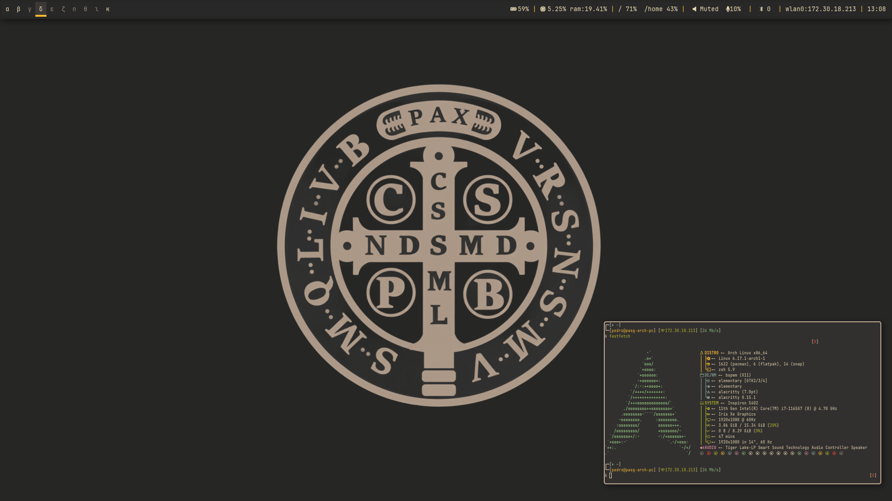

# My config Dotfiles

This repository contains my personal configuration files for a complete, keyboard-driven desktop environment on Arch Linux. The setup is built around `bspwm` as the window manager, with `polybar` for the status bar and `rofi` for application launching and menus. The entire aesthetic is based on the **Gruvbox Dark Soft** color scheme and the **JetBrains Mono Nerd Font**.

---

## Philosophy

* **Keyboard-First:** Every common action, from launching apps to managing windows and system settings, is accessible via a keyboard shortcut.
* **Minimal & Performant:** Only lightweight and essential software is used, ensuring a fast and responsive experience.
* **Visually Cohesive:** All components, from the terminal to the notifications, are themed with the Gruvbox palette for a consistent look and feel.
* **Informative & Interactive:** The status bar and menus are not just for display; they are interactive tools to manage the system.

---

## Software Stack

Of course. Here is the complete list of installed programs from our conversation, translated into English with their descriptions.

---

### System & Window Management
* **bspwm**: Main window manager.
* **sxhkd**: The daemon that manages all keyboard shortcuts.
* **polkit-gnome**: The authentication agent that prompts passwords for graphical applications requiring admin privileges (like `gparted`).

### Appearance & Theming
* **picom**: The compositor responsible for visual effects like transparency and rounded corners.
* **lxappearance**: Graphical tool to configure GTK themes, icons, and fonts.
* **dunst**: The daemon that displays notifications on the screen.
* **rofi**: The application launcher and interactive menus.
* **polybar**: Status bar.
* **gradience**: The tool for applying themes to modern GTK4/libadwaita applications.
* **Themes & Icons:**
    * `gruvbox-plus-gtk-theme-git` (AUR): MAin GTK theme.
    * `gruvbox-plus-icons-git` (AUR): Icons for the Gruvbox theme.
    * `papirus-icon-theme`: A complete icon set to ensure all applications have an icon.
    * `elementary-icon-theme` & `gtk-theme-elementary`: Theme and icon set from elementary OS.
    * `flat-remix-cursors` (AUR) & `bibata-cursor-theme` (AUR): Mouse cursor themes.
* **Fonts:**
    * `ttf-jetbrains-mono`, `ttf-fira-code`, `noto-fonts`: Common text fonts.
    * `nerd-fonts-jetbrains-mono` (AUR): Main font, with embedded icons.

### Command-Line Utilities & Daemons
* **zsh**: A powerful and interactive shell, used as the default.
* **oh-my-zsh**: A framework for managing Zsh configuration, providing themes, plugins, and helpers.
* **xdg-desktop-portal** & **xdg-desktop-portal-gtk**: So that Chrome and other apps can open the system's file picker.
* **numlockx**: To automatically enable Num Lock.
* **xss-lock**: The "bridge" that allows the system (systemd) to lock the screen when closing the notebook lid.
* **greenclip** (AUR): The daemon that stores your clipboard history.
* **sysstat**: Provides the `mpstat` command to monitor CPU usage.
* **libnotify**: Provides the `notify-send` command to create notifications.
* **bc**: A command-line calculator, used in brightness script.
* **Audio Tools:**
    * `pamixer`: To control volume via the command line (used in keybindings).
    * `pulsemixer` (AUR): The text-based interface (TUI) for managing audio.
* **Hardware Tools:**
    * `brightnessctl`: To control the notebook's screen brightness.
    * `ddcutil`: To control the brightness of external monitors (alternative).
    * `playerctl`: To control media players with multimedia keys.
* **Screenshot Tools:**
    * `flameshot`: The more powerful graphical alternative.

### Graphical Applications (GUI)
* **alacritty**: Main GPU-accelerated terminal emulator.
* **pavucontrol**: The graphical control panel to manage all audio inputs and outputs.
* **gparted**: The partition editor.
* **xfce4-settings**: Used to get tools like `xfsettingsd` (to apply themes) and `xfce4-preferred-applications`.
* **gsimplecal**: The popup calendar for Polybar.
* **Timers & Alarms:**
    * `alarm-clock-applet` (AUR): The clock, timer, and alarm application from GTK.
* **Other:**
    * `mpv`: Lightweight media player, used as the default audio player.
    * `google-chrome-stable`: Main browser.

### Development & Compilation Tools
* **git** & **base-devel**: Dependencies required to compile and install AUR packages, like `yay`.
* **yay** (AUR): A "helper" for installing and managing AUR packages.
* **gst-plugins-good**, **gst-plugins-bad**, **gst-plugins-ugly**: Media codecs for GStreamer.

---

## Key Features & Custom Scripts

This setup includes several custom scripts to enhance functionality:

* **Dynamic `sxhkd` Help Menu (`Super + h`):** A Rofi window that automatically parses `sxhkdrc` to display a searchable list of all keybindings.
* **Interactive Polybar Modules:**
    * **Audio:** Shows output/input volume. Right and left click to mute. Midle-click to open `pavucontrol`.
    * **Network:** Shows connection status and IP. Right-click to open `nmtui`. left-click to toggle networking on/off.
    * **Bluetooth:** Shows status and connected device count. Left-lick to toggle. Right-click to open `blueman-manager`.
    * **Date:** Right-click to show a `gsimplecal` popup. Left-click to open `larm-clock-applet` .
* **Smart Multi-Monitor Support:**
    * **`bspwmrc`:** A robust script ensures workspaces are always assigned to the correct monitors, regardless of detection order.
    * **`polybar/launch.sh`:** Automatically launches a bar on every connected monitor.
    * **`change_brightness.sh`:** A script that changes brightness on all connected displays simultaneously.

---

## ⌨Keybindings Overview

This is a summary of the most important keybindings configured in `sxhkdrc`.

| Category | Shortcut | Action |
| :--- | :--- | :--- |
| **Basic Management** | | |
| Open Terminal | `super + Return` | Launches `alacritty` |
| Application Launcher | `super + @space` | Launches `rofi -show drun` |
| Reload Keybindings | `super + Escape` | Reloads `sxhkd` configuration |
| Quit/Restart bspwm | `super + alt + {q,r}` | Quits or restarts the window manager |
| **Window Management** | | |
| Close/Kill Window | `super + {_,shift + }q` | Closes or kills the focused window |
| Toggle Fullscreen | `super + f` | Toggles fullscreen state |
| Toggle Floating | `super + s` | Toggles floating state |
| **Window Navigation** | | |
| Focus/Swap Window | `super + {_,shift + }Arrows` | Focuses or swaps the window in the given direction |
| Cycle Windows (local) | `super + ctrl + {Left,Right}` | Cycles through windows of all workspaces |
| Show All Windows (global) | `super + a` | Launches `rofi -show window` |
| **Workspace Navigation** | | |
| Go to / Move Window | `super + {_,shift + }{1-9,0}` | Jumps to or sends window to a specific workspace |
| Cycle Workspaces (local) | `super + alt + {Left,Right}` | Cycles through workspaces on the current monitor |
| **Application Launchers**| | |
| Lock Screen | `super + shift + b` | Runs the `lock.sh` script |
| File Manager | `super + t` | Launches `thunar` |
| Web Browser | `super + b` | Launches `google-chrome-stable` |
| Audio Control | `super + p` | Launches `pavucontrol` |
| Clipboard History | `super + v` | Launches Rofi clipboard manager |
| **System Control** | | |
| Volume Control | `Volume Keys` | Controls system volume with `pamixer` |
| Media Control | `Media Keys` | Controls media players with `playerctl` |
| Brightness Control | `Brightness Keys` / `super + alt + Up/Down`| Controls brightness on all monitors |
| Screenshot (Area) | `super + Print` | `flameshot gui` |

---
